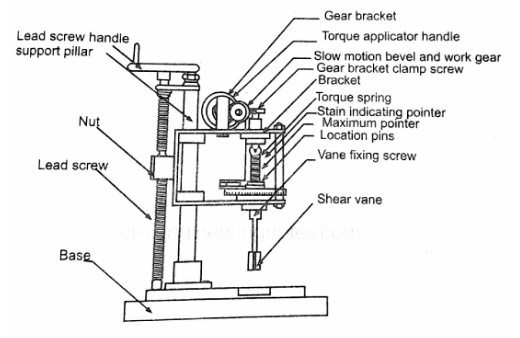
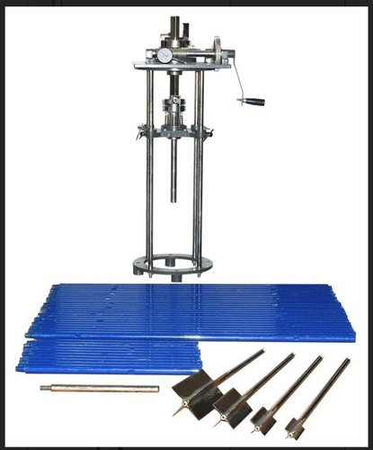

### INTRODUCTION 

One of the major strength parameters studied for the soil is its shear strength. It symbolizes the amount of shear stress i.e., the load that the soil can withstand at any given time with respect to different environmental conditions.

Thus shear strength of soil may be explained as the maximum shear stress that the soil can withstand without undergoing any structural damage or any failure.

The drainage path of the water plays an important role in the shear tests performed. The various drainage paths employed while performing the tests are:

<li><strong>Drained:</strong> In this method the water is allowed to pass through both the sides of the soil sample. In field conditions this happens when the soil has been sandwiched between two sand or any other highly permeable layers.</li> 

<li><strong>Partially drained:</strong> In this type of drainage path, water is allowed to pass only through one side of the soil sample. In field conditions this happens when the soil is sandwiched between one hard rock layer and a permeable layer.</li> 

<li><strong>Undrained:</strong> Here the water is not allowed to pass through the soil sample. In field conditions this situation occurs when the soil is sandwiched between two hard rock layers.</li>

#### Shear strength tests

The different types of tests employed to quantify the shear strength of soil are:

<li> Direct shear test or shear box test</li>
<li> Triaxial compression test</li>
<li> Unconfined compression test</li>
<li> Vane shear test</li>
<li> Borehole shear test</li> 

Direct shear test, triaxial compression test and unconfined compression tests are purely lab tests that are performed on the collected soil sample whereas vane shear test and borehole shear test can be performed at the site and Vane shear test is the most commonly used test method to find out the unconfined shear strength of the soil at its natural undisturbed state.

#### Scope and Need

<li> By conducting this test on the soil sample, we can find out the shear strength of the soil in its original state or even in the remoulded state.</li>
<li> Thus this test can be carried out on undisturbed as well as disturbed samples.</li>
<li> This test can be used to find out the sensitivity of soft clays.</li> 

  

Schematic representation of vane 

### Vane shear test

Vane shear test is a method used to examine the undrained unconfined shear strength of cohesive soil, especially soft clays. The test can be conducted in-situ or in the laboratory. It is simple, quick, and also very cost-effective to carry out. This test is not suitable for non cohesive soils.

  

Laboratory Vane Shear Apparatus

(Source: <a href="https://i0.wp.com/civilengineeringnotes.com/wp-content/uploads/2021/04/909607010987113_909607077437113-e1617701278585.jpg?fit=1500%2C961&ssl=1">Laboratory Vane Shear Apparatus</a>)

 

  

In-Situ Vane Shear Apparatus

(Source: <a href=" https://5.imimg.com/data5/ANDROID/Default/2021/4/JL/OQ/XD/4545460/1618950196759-jpg-500x500.jpg">In-Situ Vane Shear Apparatus</a>)

In this test the vane is inserted inside the soil and is rotated at a constant speed until the pointer indicating the angle of twist starts rotating backwards.

The laboratory test of vane shear test is useful for soils which have low shear strength of less than 0.5kg/cm2. The test can be used to find the undrained strength of soil in its undisturbed state and also the remoulded state.

The formula used to calculate the undrained shear strength of the soil sample is as follows:

<!--  -->

<!-- -->

Where, 

T = Torque at failure,

H = Height of vane (cm),

D = Diameter of vane (cm)

#### Sensitivity

Sensitivity of clay can be defined as the ratio of the unconfined compression strength of the soil in its undisturbed state to that of the remoulded state.

<!-- Sensitivity =  -->

  

|    **Classification**    | **Sensitivity** |
|:------------------------|:---------------:|
| Insensitivity clays      |        ~1       |
| Slightly sensitive clays |       1-2       |
| Medium sensitive clays   |       2-4       |
| Very sensitive clays     |       4-8       |
| Slightly quick clays     |       8-16      |
| Medium quick clays       |      16-32      |
| Very quick clays         |      32-64      |
| Extra quick clays        |       > 64      |

Classification of clay with respect to sensitivity

(Source: <a href="https://www.geoengineer.org/storage/education/2379/editor_photos/9704/Picture3_1.jpg">Classification of clay with respect to sensitivity</a>)

