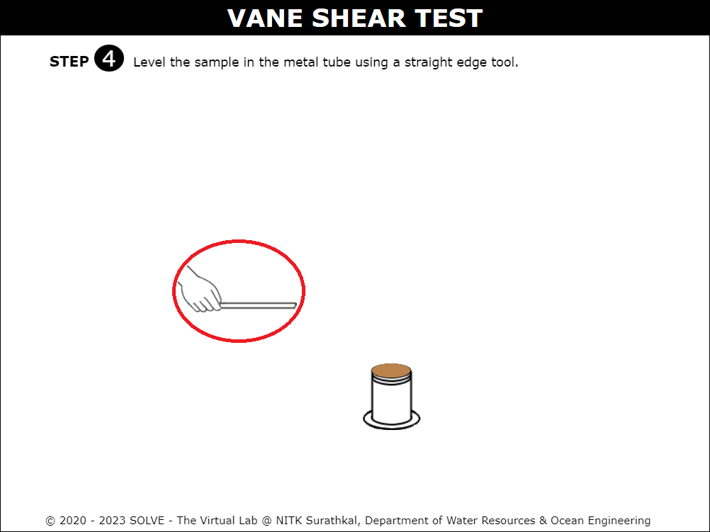

##### These procedure steps will be followed on the simulator

1. Click on the simulation button and this page will be displayed. Hover over the "Description" button to get a brief explanation about the experiment. Then click on Next button to proceed. 
 

2. Click on the measuring jar to add water to the clay sample.  
 

3. Click on the trowel to mix water with a clay sample until a fine paste is formed. 
 

4. Click on the ON and TARE button of the weighing machine. Then click on the empty metal tube to place it on the weighing machine.  
 

5. Click on the spatula to fill the soil sample to empty the metal tube. 
 

6. Click on the straight edge tool to remove the extra soil and level the top surface.  
 

7. Click on the scale to measure the height and diameter of the vane. 
 

8. To lower the shear vane click on the  clamp screw so that the shear vane is 1cm below the top surface of the specimen.  
 

9. Click on the marked portion, a zoomed image will be displayed which shows the initial reading. Then click on the next button to proceed further. 
 

10. Click on the handle, a zoomed image will be displayed and rotate at a uniform speed until the specimen fails.  
 

11. When the specimen fails the point indicator will move backward. Then enter the calculated value for angle of twist. Click on "Check" and "Result" to evaluate.   
 

12. The observation table with calculated value for angle of twist will be displayed. Then click on the next button.  
 

13. The experiment is repeated for 2 more trials and the observation table will be displayed.  
 

14. Plot the characteristic curve for Angle of twist  v/s Torque. Hover on the description tab, a note will be displayed. Then click on the next button. 
 

15. Enter the calculated value then give "check" and "Result" to verify the correct answer. 
 

16. After the answer is verified by giving a check and result, Inference will be displayed.  
   
